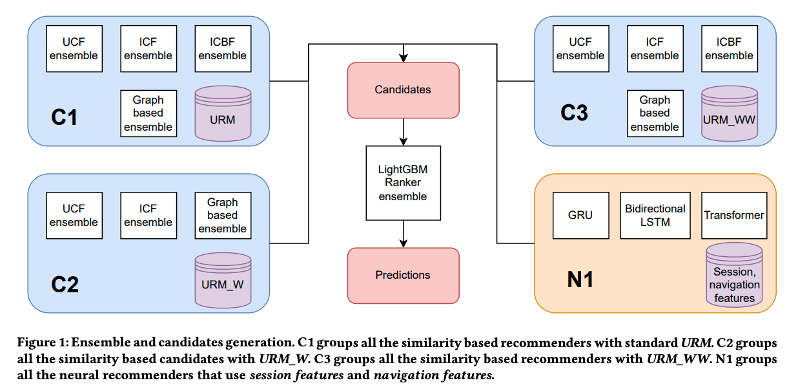

# Summary

## Link

<https://dl.acm.org/doi/pdf/10.1145/3556702.3556845>

## Idea

Provide in-session recommendations. First, create multiple recommenders that generates candidates items for each session: similarity-based recommenders for short sessions, and neural-based recommenders for longer, more nuanced sessions. Then, create an ensemble of rankers to re-rank the candidates.

## Context

RecSys 2022 focused on in-session recommendation. The challenge is to predict the item bought by the user, knowing items they have seen in the current session.

**Challenges**:

- Sessions containing duplicated consecutive items. This is because the page is reloaded -> Remove reloaded pages.
- Many items in the test set are not available in the testing phase -> Cold start problem for these items.
- Sessions are anonymized, which limits the scope of the available information to the current session and prevents creation of user based features.
- Items and features are anonymized, which prevents feature engineering driven by domain knowledge.
- Sessions in the test set are randomly truncated

## Feature engineering

### User rating matrix

n_sessions x n_items matrix, where each cell is the number of times the user has seen the item in the session. Then create another 2 matrices by multiplying this by either the

- weighted, decayed distance (in days) from the test sessions (I don't quite understand the rationale for this).
- weighted, decayed distance from the last item in the session (basically how close each item is to the purchased item).

### Item content matrix

Create an n_items x (n_features x feature_values) matrix (one hot encoded), then train an autoencoder to condense this.

### Session features

- Cosine-transformed starting and ending datetime to model the cyclic nature of time
- Session properties:
  - number of items seen,
  - session length,
  - average time user spent looking at an item
  - AFK: Whether the user spent more than 30 mins looking at an item
- Special dates (e.g., Xmas, black friday) and hours (18-20:00 each day where the majority of purchases happened)
- Session internal similarity (basically how similar the items in each session is): For each session, stack the feature vectors of each product, compute SVD then take the first eigen value as the session similarity.
- Navigation features: For each session, create time series that:
- compute the time elapsed between 2 items
- cosine similarity between 2 items, based on (1) the item content matrix, (2) compressed item features from the autoencoder

## Models

### Candidate selectors

Focus on high recall to get as many relevant items as possible, which are then reranked.

#### Collaborative & content-based filtering

Primary metric: recall

- Item collaborative filtering: Find similar items to the ones seen in the current session based on their ids
- Item content based filtering: Find similar items to the ones seen in the current session based on their features
- User collaborative filtering: Find items in sessions similar to the current session.

#### Graph-based recommenders

Primary metric: recall

- P3a: Random walk between users and items
- RP3b: Based on P3a, but divide the similarities by item popularity.

Trained these based on 3 versions of the user rating matrices -> 6 models.

#### Neural recommenders

Primary metric: accuracy

- GRU: predict the bought item based on the previous items in the session, in the order of visit.
- Bi-directional LSTM: Same logic as above, but in both the order of visit and reverse order.
- Transformer network: Sees the session as a whole, focus on the most relevant parts to predict the bought item.

### Rankers

Input: Session features and scores from the candidate selectors
Target: Whether the item is bought or not.
Model: LightGBMrankers with LambdaRank objective (takes a pair of items at a time and computes an ordering of them. In this way, a ranking function is optimized so that relevant items get a higher score while non-relevant items get a lower score). Final ranking is the average of 10 LightGBMRankers

Drop sessions where the bought item is not in the candidate list suggested by the candidate selectors. This is because if we include the correct item when the candidate selectors don't, the rankers can easily learn to always put the suggested items at the bottom of the list, which artificially boosts the accuracy.
