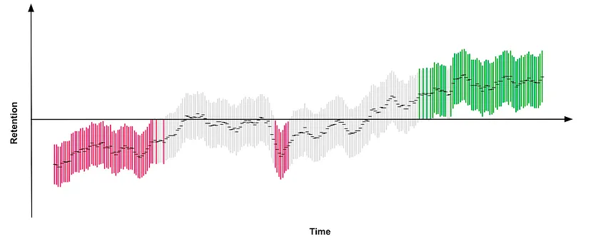

# Summary

## Link

<https://medium.com/@AnalyticsAtMeta/notifications-why-less-is-more-how-facebook-has-been-increasing-both-user-satisfaction-and-app-9463f7325e7d>

## Idea

The long term effect of A/B tests can be completely opposite to the short term effect. Introduced a few ways to tackle this.

## Background

- Reduce the number of notifications sent by only sending in the most relevant notifications led to a short term drop in user engagement, but over the long term, the effect reversed.

## Approach

- If the experiment is run over a long period of time, the difference between the initial effect and the year-long effect may be because of time difference (e.g., change in context, new users, etc.). 1 way to tell is to run a replicated experiment a few months after the first one, let it run for a while, then compare its trend with the original experiment. If the pattern match up, it's likely the effect was true (and not because of the time difference).
- If we don't want to wait:
  - Using knowledge from past experiments. E.g., if we know that sending less notifications can have a short term loss but long term gain, then we'll be more cautious of immediate gains in engagement by sending more notifications
  - Create a long-term proxy: Run a few long-run experiments, then use that data to train a model to predict the coefficients of various treatments toward the long term effect. Then use that model to predict the long term effect of new experiments.
