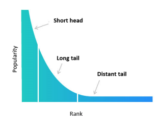

# Summary

## Link

<https://dilbertai.wordpress.com/2020/08/09/paper-explained-managing-popularity-bias-in-recommender-systems-with-personalized-re-ranking/>

## Idea

Introduce some metrics to measure popularity bias. Then talk about xQUAD. Choose item based on its relevance to the user and the diversity it brings to the final list.

## Measuring popularity bias

- Average Recommendation Popularity: Sum up the ratings of all recommended items and divide by the number of recommended items then the number of users
- Average Percentage of Long Tail Items: Percentage of items belonging to the long tail, averaged across all users.
- Average Coverage of Long Tail items: % of long tail items recommended to users, averaged across all users.

-> Defining the 'long tail' is subjective.

## Fixing popularity bias

### Popularity aware learning

- During training, add item popularity as an input feature
- During inference, replace the popularity feature with a constant value ??? Different constant values will lead to different recommendation results. This [paper](https://www.researchgate.net/publication/335771749_PAL_a_position-bias_aware_learning_framework_for_CTR_prediction_in_live_recommender_systems) suggests an alternative.

### xQUAD (explicit query aspect diversification)

Recognise the difference among users in their interest in long-tail items, instead of uniformly increasing the diversity.

Algorithm:

- Given a ranked list of reccs (R), based on a base ranker
- Create an empty list S that's used to store the final ranking
- For all remaining items in R, compute a score based on 2 criteria. These are then weighted (with a parameter lambda) and summed up to be the final score.
  - The likelihood that the user is interested in each item, independent of other items on S so far (promotes ranking accuracy). This can be the score outputted by the base ranker.
  - New information that it brings to the list (promotes diversity). For example, if the list S already has shirts, then items that are not shirts will receive higher scores which increase their chance of being included in S. There are 2 ways to calculate this:
    - Binary: 1 if the item is not the same type as the items in S, 0 otherwise. In the shirt example, this score will be 0 for all shirt candidates.
    - Smooth: Replace 1 or 0 with the % of items of the same category in S.

Items that are in the distant tails will be ignored because their scores are not reliable due to the lack of ratings.

Experimental results show that increasing lambda increases diversity but decreases accuracy.
