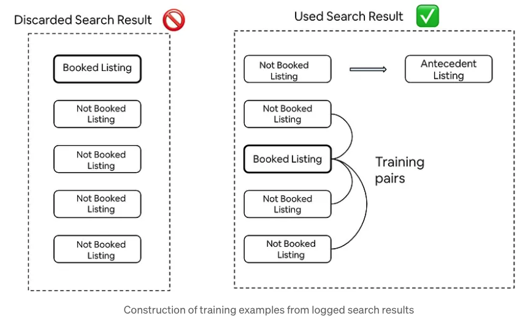

# Summary

## Link

<https://medium.com/airbnb-engineering/learning-to-rank-diversely-add6b1929621>

## Idea

(Article was poorly written with very little detail on model training and serving. I had to read the original paper).

Use a NN to predict the diversity score of a listing in a search result, then use the score to re-rank the search results, one by one, from the 2nd position onward.

## Background

Low prices are preferred. Can be seen through the partial dependence curve.
Popularity bias is the tendency in recommendations.

## Approach

Build a NN to predict the diversity of a list of listings (similarity network) to accompany the ranking NN.

- Training dataset:
  - Remove all search results with the booked listing being the first listing.
  - For the remaining search results:
    - Use the top listing as an "antecedent listing"
    - For the remaining listings (from the 2nd position), create pairs of booked and not-booked listings.
  
- Model
  - Train a NN to assign a higher probability to the booked listing in each pair.
  - Substract the predicted probability of the antecedent listing from the probability of the booked listing to get the diversity score. Reasoning: Guests who skipped the antecedent listing must have picked something not similar to it. Because if they were similar, the antecedent listing would have been booked.
- Serving:
  - Use the listing with the highest booking probability as the 1st result.
  - Next position: Get the item with the highest booking probability, discounted by how similar it is to the antecedent listing. Repeat until the list is full -> O(n^2) complexity.

## Results

- Uplift in uncancelled bookings, 0.8% increase in booking value.
