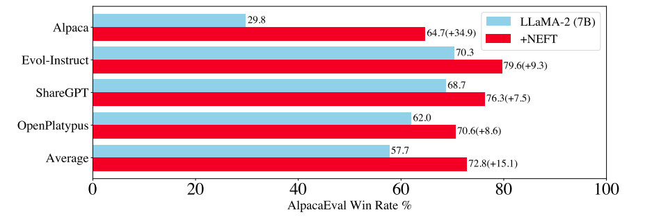
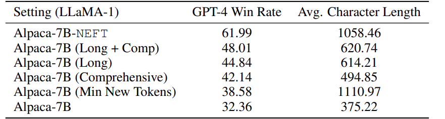

# Summary

## Link

<https://arxiv.org/pdf/2310.05914>

Code: <https://github.com/neelsjain/NEFTune>

## Idea

Add noise to the embedding vectors during the forward pass of the fine tuning process. The noise is sampled from a uniform distribution, calculated based on the sequence length, embedding dim, and a scaling constant. This can act as a form of regularisation.

## Result

- Resulted in a significant improvement in AlpacaEval Win Rate % (Exampled in a few LLMs)

- Did not harm the model's performance on OpenLLM leaderboard tasks
- This may impact some other aspect of the model's behavior. In the case of LLaMA-2 Chat (7B) which was already extensively tuned, its ability to not outputting toxic behavior was affected.
- When combined with QLoRA, we still get a performance boost, but not as great as when tuning full scale.

- Resulted in a significant increase in training loss, but a slightly lower validation loss (I think this is consistent with how data augmentation works).
- Significantly lower ROUGE-L and BLEU scores, which indicates that the model tuned without NEFT tend to recite the model response in the training data more.
- The model output is more verbose, but did not result in more repetition, and instead, it gives additional details.
- Although longer and coherent answers (increase verbosity) are favored by both human and machine evaluators, this alone did not explain the increase in performance
  - Prompting the model to generate longer response did result in a performance boost, but not as great as NEFT.
  - Forcing answers as long as those produced by NEFT (by blocking EOS token) did not result in a better performance than standard fine-tuning. (I think this makes sense, but at the same time don't think this is a fair comparison. The model being forced to keep talking when it has said everything it needs to say is not a good thing.)
  - Using gaussian noise instead of uniform noise produced longer answer than NEFT, but that did not result in a better performance than NEFT

- Human evaluators also greatly preferred the NEFTuned model's responses (win rate of 74.6% on instructions from AlpacaEval).

## Why this works

The author admit that "despite our empirical studies, we do not have a conclusive understanding of why NEFTune works". But one theory could be that adding noise help the model overfit less to the specifics of the instruction tuning dataset, like formatting, word length, etc.
