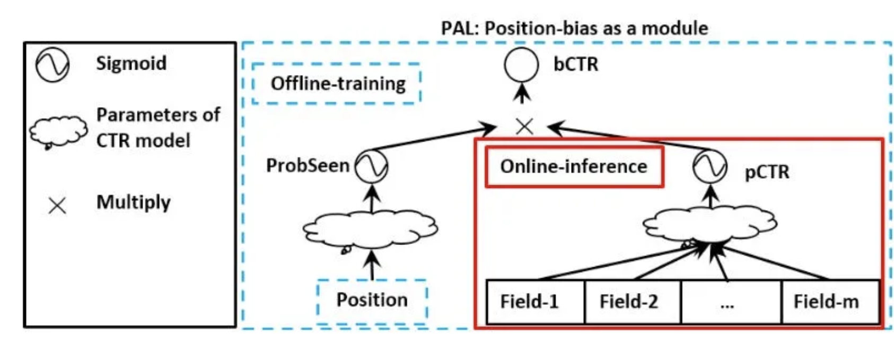

# Summary

## Link

<https://towardsdatascience.com/the-rise-of-two-tower-models-in-recommender-systems-be6217494831>

## Idea

Summary of popular two-tower approaches, which are neural networks with 2 components, 1 for modelling bias (starting with positional) and the other for relevance.

## Approaches

### Huawei's paper on position-aware learning to rank

- Factorise the learning problem as `p(click|x,position) = p(click|seen,x) x p(seen|position)`.
  - `p(seen|position)`: The probability of the position being seen, modelled with a shallow neural network (bias tower) because it only has 1 feature.
  - `p(click|seen,x)`: The probability of the item being relevant to the user (if seen), modelled with a deep network (engagement tower).

- At inference time, only run a forward pass through the engagement tower.

### Youtube's Watch Next

- Same idea as the previous, but instead of multiplying the probabilities, they sum the logits: `logit(click|x,position) = logit(click|seen,x) + logit(seen|position)` This is possible because log(x) + log(y) = log(x * y).
- Introduce other bias factors, such as device, e.g., phones have smaller screens which renders the positions on the page differently.

### Google's disentangling relevance and bias in ULTR (Unbiased learning to rank)

*This bit the author didn't explain really well so here's what I learned from the original paper [here](<https://arxiv.org/pdf/2212.13937.pdf>)*

- Argued that the 2 towers cannot learn independently due to the confounding effect of relevance on position. (of course, more relevant items are ranked higher!), which violates the assumption of positional and relevance signals.
- Extreme case: historical rankings are determined by a relevance model that can perfectly explain clicks, then the positional tower can absorb all information during training. This makes the relevance tower useless because there's no information left for it to learn. *Don't agree with this. Being able to map input features (many) to item ranking (one) does not mean it's possible to map item ranking (one) back to input features (many)*
