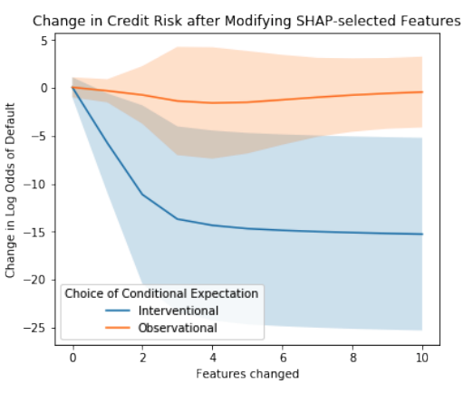
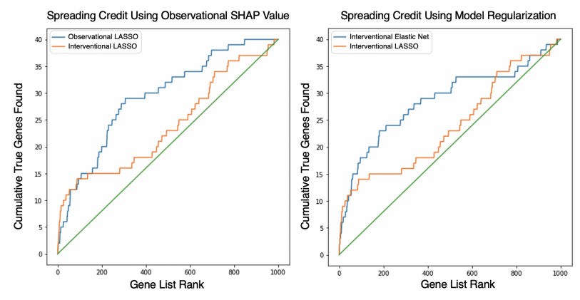

# Summary

## Link

<https://arxiv.org/pdf/2006.16234.pdf>

## Idea

- Use the interventional method: True to the model when we want to explain the model.
- Use the observational method: True to the data when we want to explain the data generating process.

## Comparison

### Interventional method: True to the model

Work out the importance of a feature by pertubing it and see how the model reacts.

-> Does not need a reference dataset

- Can lead to evaluating the model on impossible data points by breaking the dependency between features. -> - Best case for this is when the features are independent to start with.
- Use this method when we care more about the model and how it makes decisions. E.g., when someone's just rejected a loan, they want to know what they could have done instead. In this case, they need to improve on what the model cares about so we want to provide insights to the model's decision making.
- Feature selection based on this has a much stronger impact on the model's predictions than the observational method, as this method attributes importance to features directly used by the model.

Example: Credit risk scoring

### Observational method: True to the data

Observe difference values of a feature, conditioning based on the other features and see how the model reacts. Use this method when we care more about the natural mechanism in the world. This is good for causal discovery as we seek to explain the data generating process.

This means the feature is sampled based on its expeted value given the other features. The 'condition' here can be modelled using an autoencoder, conditional distributions. This is quite a complex process and the time complexity is estimated to be O(n3)

-> Needs a reference dataset.

- Can attribute importance to features not used by the model (the attribution will be split between correlated variables). However this is useful in detecting bias. For instance, a linear model may use correlations between features to implicitly depend on a sensitive feature that was explicitly excluded. In terms of causal discovery, we care more about the natural mechanism than the model. Therefore, spreading credits among correlated features is a good thing.
- However, if we want to spread credit between correlated features, we can also train an Elastic Net regression, which takes far less time (In the paper's example, 1000 samples took 6 hours using the CPUs on a 2018 MacBook Pro, while hyperparameter tuning and fitting an Elastic Net regression took a matter of seconds.)

Example: Detecting genes that result in expressions

